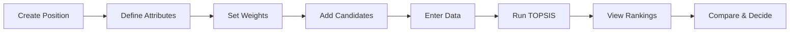

# Recruitment Platform with TOPSIS Integration

A recruiter-focused decision support tool that enables customizable candidate evaluation using operations research techniques (TOPSIS algorithm).

## Tech Stack

| Layer | Technology |
|-------|------------|
| Frontend | React 19 + Vite |
| Backend | Convex (BaaS) |
| Styling | Tailwind CSS v4 |
| Routing | React Router v7 (SPA) |
| State | Convex reactive queries |
| Charts | Recharts |

> [!NOTE]
> Project will be initialized using CLI tools (`npm create vite`, `npx convex init`, etc.) - no manual config file creation.

---

## Core Concepts

### TOPSIS Algorithm Overview

**TOPSIS** (Technique for Order of Preference by Similarity to Ideal Solution) ranks alternatives by:

1. **Normalize** the decision matrix
2. **Weight** the normalized values
3. Calculate **Ideal Best** (A+) and **Ideal Worst** (A-) solutions
4. Compute **distance** from each alternative to A+ and A-
5. Calculate **relative closeness** score (0-1, higher = better)

```
Closeness Score = Distance to Worst / (Distance to Best + Distance to Worst)
```

This provides an objective, mathematically-grounded ranking of candidates.

---

## Milestone 1: Project Foundation

**Goal**: Set up the development environment and basic app structure

### Setup Commands
```bash
# 1. Create Vite + React project
npm create vite@latest . -- --template react

# 2. Install dependencies
npm install

# 3. Install Tailwind CSS v4
npm install tailwindcss @tailwindcss/vite

# 4. Install Convex
npm install convex
npx convex init

# 5. Install React Router
npm install react-router

# 6. Install Recharts for visualization
npm install recharts
```

### Tasks
- [ ] Run setup commands above
- [ ] Configure Tailwind in `vite.config.js`
- [ ] Set up React Router with 4 routes (Dashboard, Positions, Position Detail, Analysis)
- [ ] Create base layout component with navigation
- [ ] Add Tailwind base styles and color theme

### Deliverables
- Running dev environment with Convex connected
- SPA navigation between pages
- Modern Tailwind styling foundation

---

## Milestone 2: Position/Job Management

**Goal**: Allow recruiters to create positions with custom evaluation criteria

### Data Model

```typescript
// convex/schema.ts
positions: defineTable({
  name: v.string(),           // "Senior Developer"
  description: v.string(),    // Job description
  attributes: v.array(v.object({
    name: v.string(),         // "Years of Experience"
    type: v.union(v.literal("number"), v.literal("rating")),
    weight: v.number(),       // 0.0 - 1.0 (importance)
    beneficial: v.boolean(),  // true = higher is better
    min: v.optional(v.number()),
    max: v.optional(v.number()),
  })),
  createdAt: v.number(),
})
```

### Features
- [ ] Create new position with name & description
- [ ] Add/remove/edit custom attributes
- [ ] Set attribute weights (with validation: sum = 1.0)
- [ ] Mark attributes as beneficial or non-beneficial
- [ ] View list of all positions
- [ ] Delete positions

### UI Components
- `PositionForm` - Create/edit position
- `AttributeEditor` - Dynamic attribute configuration
- `WeightSlider` - Visual weight allocation
- `PositionList` - Dashboard of all positions

---

## Milestone 3: Candidate Data Entry

**Goal**: Enable tabular input of candidate data for each position

### Data Model

```typescript
// convex/schema.ts
candidates: defineTable({
  positionId: v.id("positions"),
  name: v.string(),
  data: v.array(v.object({
    attributeName: v.string(),
    value: v.number(),
  })),
  createdAt: v.number(),
}).index("by_position", ["positionId"])
```

### Features
- [ ] Add candidates to a position
- [ ] Dynamic form based on position's attributes
- [ ] Inline editing in table view
- [ ] Bulk data entry (paste from spreadsheet)
- [ ] Delete/edit individual candidates
- [ ] Validation (within min/max bounds)

### UI Components
- `CandidateTable` - Spreadsheet-like data grid
- `CandidateForm` - Add/edit single candidate
- `BulkImport` - Paste CSV/Excel data

---

## Milestone 4: TOPSIS Engine

**Goal**: Implement the TOPSIS algorithm and integrate with the UI

### Algorithm Implementation

```typescript
// lib/topsis.ts
interface Candidate {
  id: string;
  name: string;
  values: number[];
}

interface Attribute {
  weight: number;
  beneficial: boolean;
}

function topsis(
  candidates: Candidate[],
  attributes: Attribute[]
): RankedCandidate[] {
  // 1. Build decision matrix
  // 2. Normalize (vector normalization)
  // 3. Apply weights
  // 4. Find ideal best/worst
  // 5. Calculate Euclidean distances
  // 6. Compute closeness scores
  // 7. Rank by score
}
```

### Features
- [ ] Pure TypeScript TOPSIS implementation
- [ ] Handle edge cases (all same values, single candidate)
- [ ] Store results in Convex for history
- [ ] Run analysis on-demand

### Outputs
- Ranked list of candidates
- Closeness score (0-1) for each
- Distance to ideal best/worst

---

## Milestone 5: Results Visualization

**Goal**: Provide clear, actionable insights from TOPSIS analysis

### Features
- [ ] Ranked candidate leaderboard
- [ ] Score breakdown per candidate
- [ ] Comparison chart (radar/bar chart)
- [ ] Ideal solution visualization
- [ ] Export results (CSV/PDF)

### UI Components
- `RankingTable` - Sortable results with scores
- `ScoreBreakdown` - Per-candidate detail view
- `ComparisonChart` - Visual comparison (using Recharts or Chart.js)
- `IdealSolutionCard` - Show what the "perfect" candidate looks like

### Visualizations
1. **Bar Chart**: Closeness scores comparison
2. **Radar Chart**: Multi-attribute profile overlay
3. **Distance Plot**: Visual distance to ideal/anti-ideal

---

## Milestone 6: Polish & Enhancements

**Goal**: Production-ready quality and user experience

### Features
- [ ] Responsive design (tablet-friendly)
- [ ] Loading states and error handling
- [ ] Empty states with guidance
- [ ] Confirmation dialogs for destructive actions
- [ ] Keyboard shortcuts
- [ ] Dark/light theme toggle

### Optional Enhancements
- [ ] Compare 2-3 candidates side-by-side
- [ ] Save/load analysis scenarios
- [ ] Sensitivity analysis (how weight changes affect ranking)
- [ ] Additional OR methods (AHP, VIKOR) for comparison

---

## Project Structure

```
src/
├── components/
│   ├── ui/              # Reusable UI primitives
│   ├── positions/       # Position management
│   ├── candidates/      # Candidate data entry
│   └── analysis/        # TOPSIS results & charts
├── lib/
│   ├── topsis.ts        # TOPSIS algorithm
│   └── utils.ts         # Helpers
├── pages/
│   ├── Dashboard.tsx    # Home/overview
│   ├── Positions.tsx    # Position list
│   ├── PositionDetail.tsx
│   └── Analysis.tsx     # Results page
├── App.tsx
├── main.tsx
└── index.css

convex/
├── schema.ts            # Database schema
├── positions.ts         # Position mutations/queries
├── candidates.ts        # Candidate mutations/queries
└── analysis.ts          # Analysis storage
```

---

## User Flow



---

## Verification Plan

### Automated Testing
- Unit tests for TOPSIS algorithm with known inputs/outputs
- Edge case testing (empty data, single candidate, equal scores)

### Manual Verification
- Create sample position with 5+ attributes
- Input 10+ test candidates
- Verify rankings match hand-calculated TOPSIS
- Test all CRUD operations
- Verify real-time updates via Convex

---

## Timeline Estimate

| Milestone | Estimated Duration |
|-----------|-------------------|
| 1. Project Foundation | 1-2 hours |
| 2. Position Management | 2-3 hours |
| 3. Candidate Data Entry | 2-3 hours |
| 4. TOPSIS Engine | 1-2 hours |
| 5. Results Visualization | 2-3 hours |
| 6. Polish & Enhancements | 2-3 hours |

**Total**: ~10-16 hours of development

---

## Questions Resolved

| Decision | Resolution |
|----------|------------|
| User roles | Single role: Recruiter |
| Authentication | Not required |
| Data input | Manual tabular entry |
| Attributes | Fully customizable per position |
| Scope | Demo/prototype with production quality |
